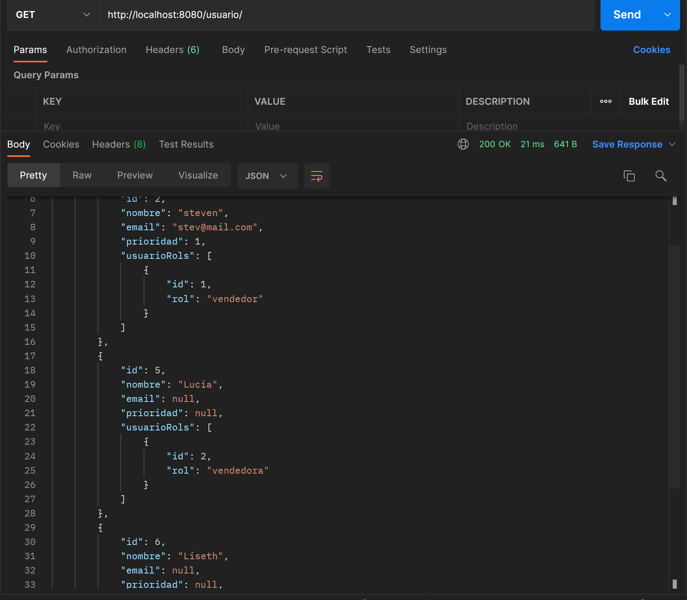
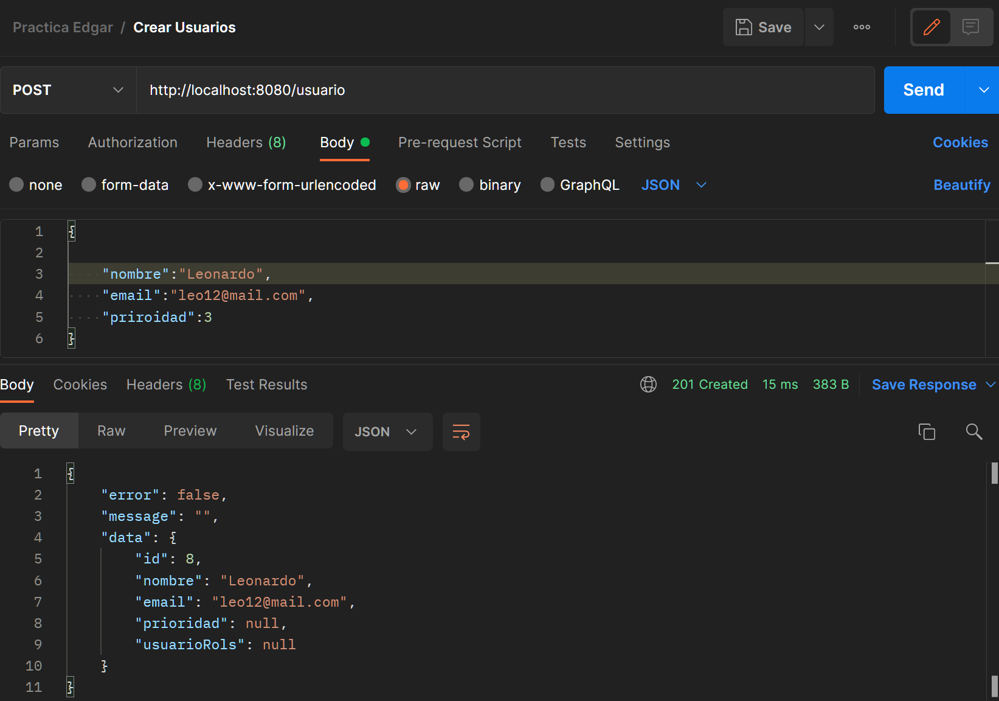
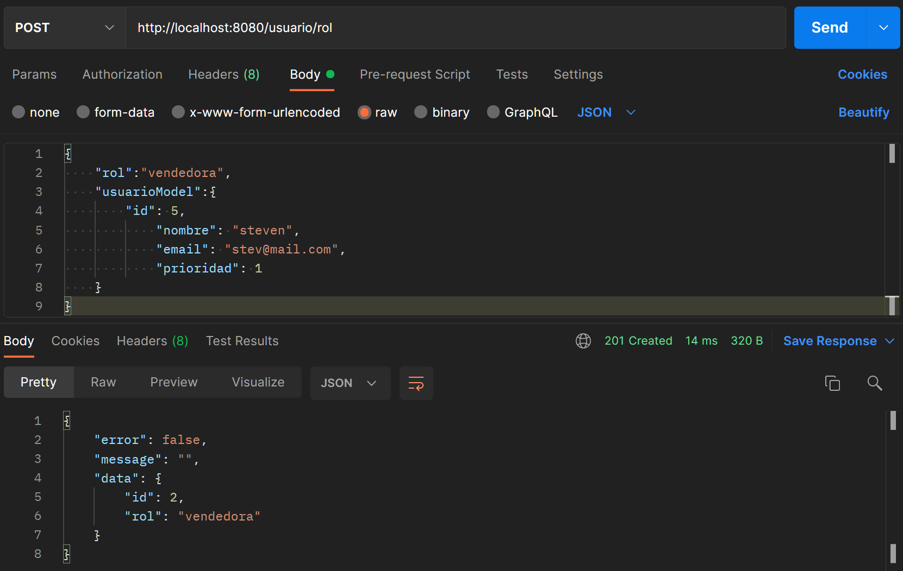
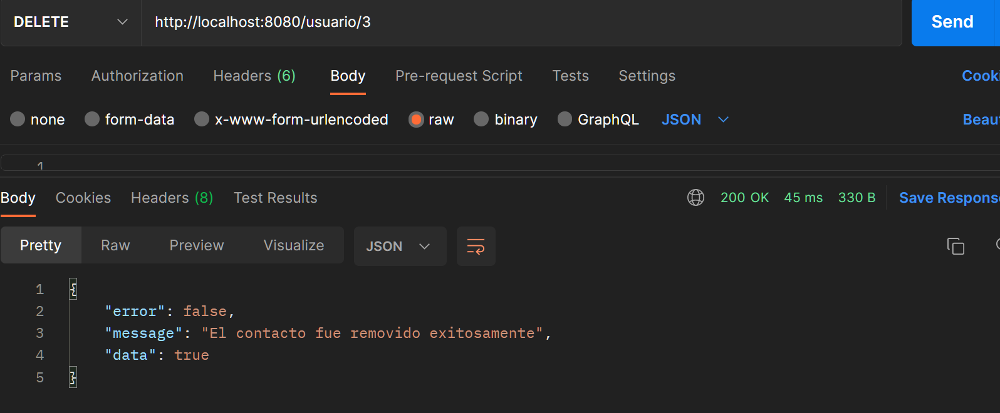
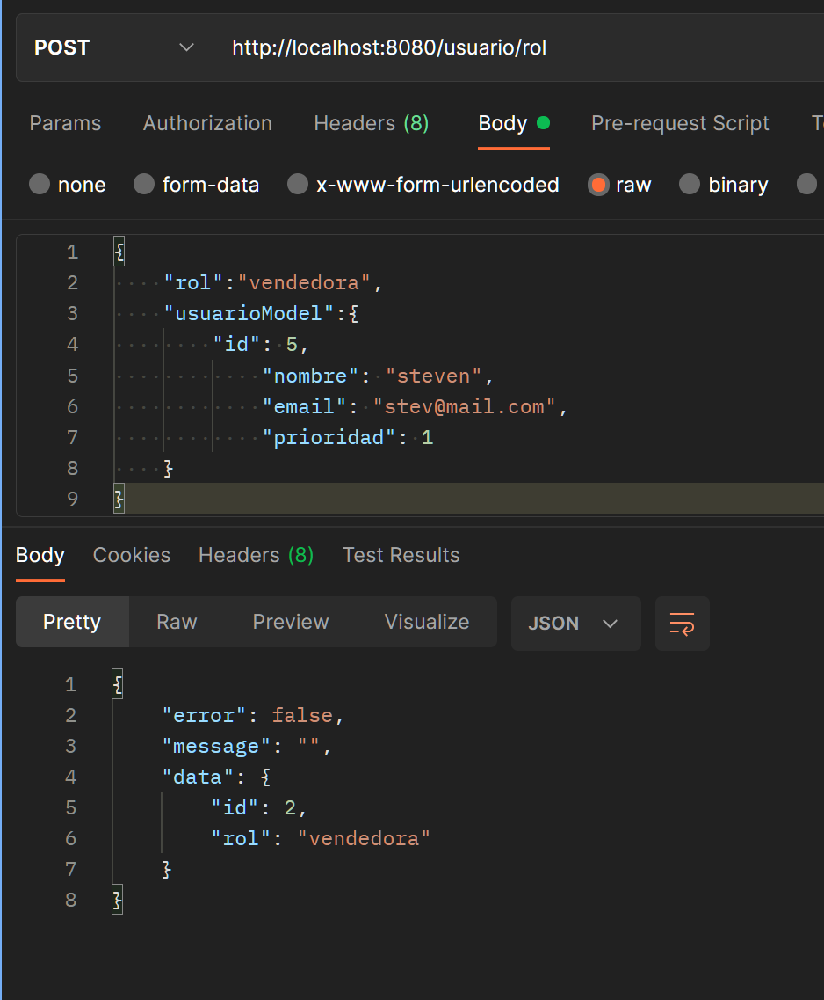
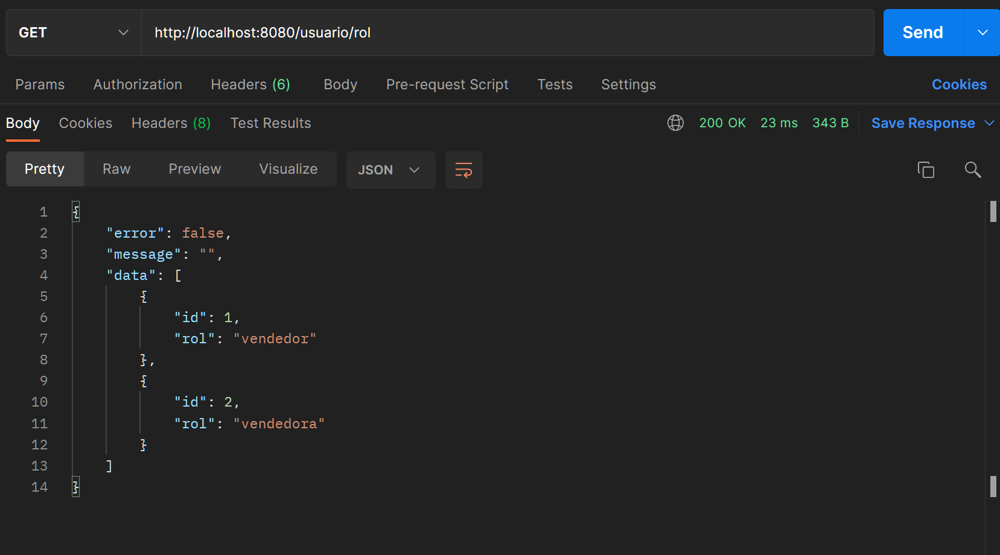

Taller SpringBoot

Ejecución de la API de obtener usuarios.

image:

Se puede visualizar que se realiza la consulta perfectamente y trae toda la información de los usuarios, junto con el rol asignado.

Ejecución de la API de crear usuarios.

image:

Se puede visualizar que se crea un usuario correctamente.

Ejecución de la API de actualizar usuarios.

image

se puede visualizar que se actualiza un usuario correctamente.

Ejecución de la API de eliminar usuarios.

image

Se puede visualizar que se muestra un mensaje si no encuentra el id, esto es porque el id 1 no existe en la bd.

Ejecución de la API de crear ROL

image

Se puede visualizar la creación del rol correctamente y se asigna al usuario 15.

Ejecución de la API de obtener roles.

image

Se puede visualizar la correcta ejecución de este método.

Cuando hacemos una consulta comprobamos que este fue actualizado correctamente.
